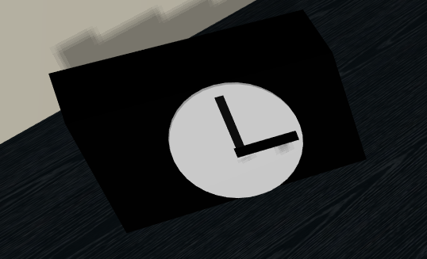
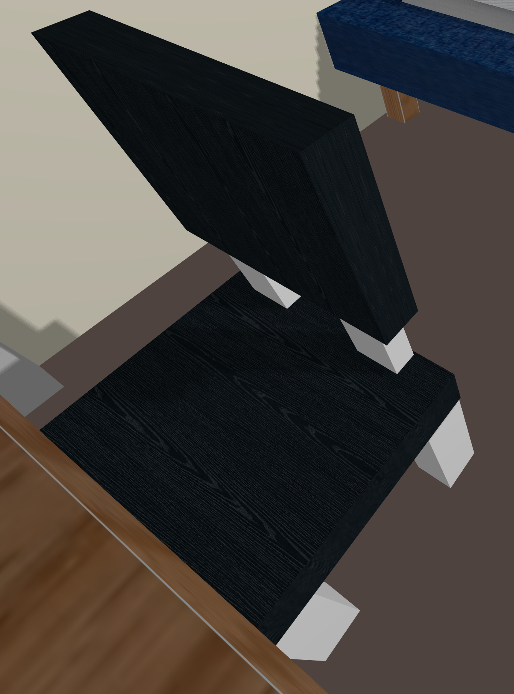
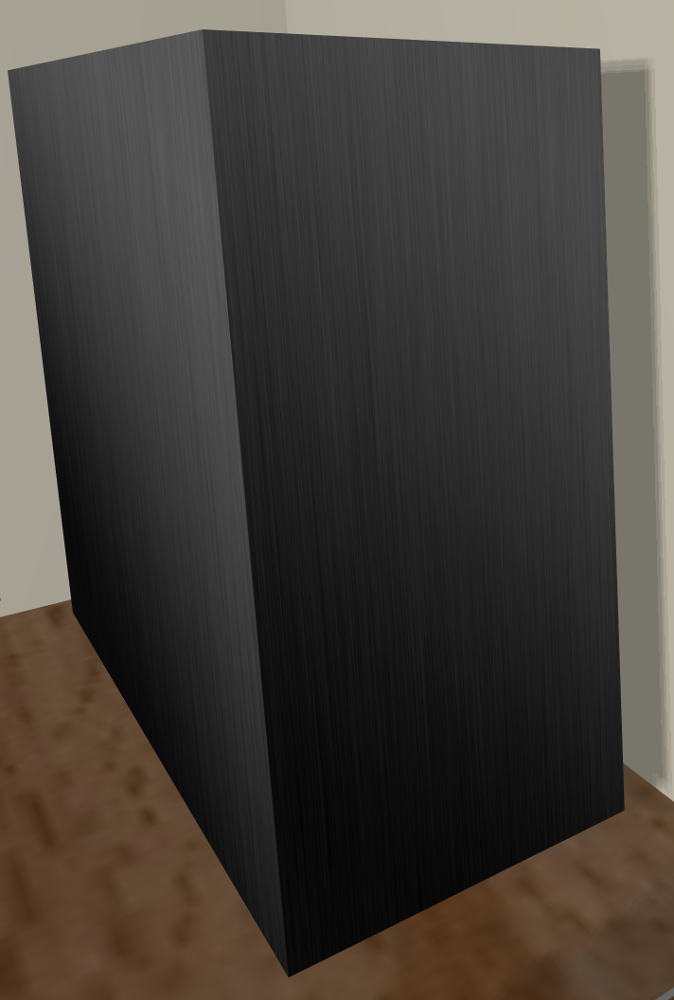
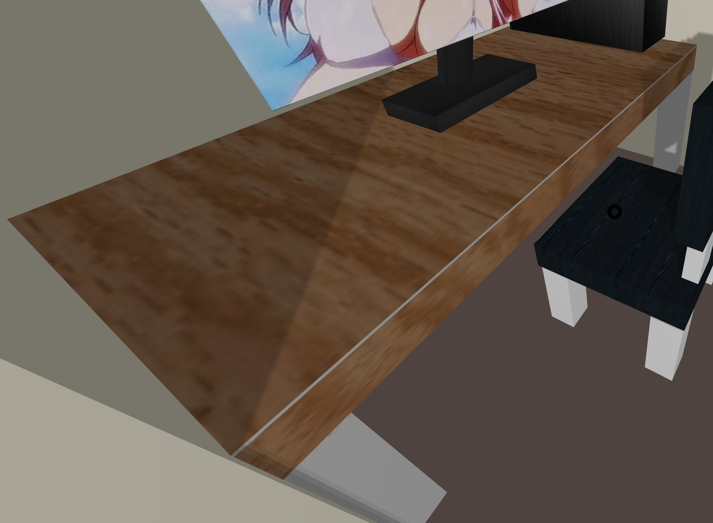
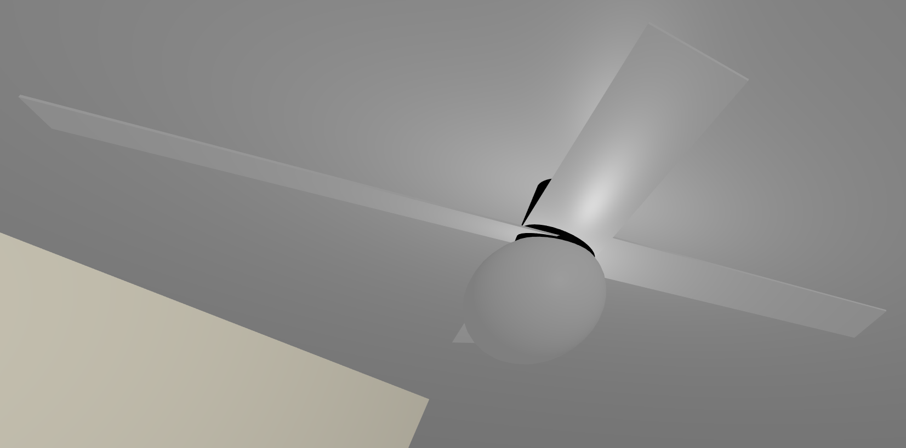
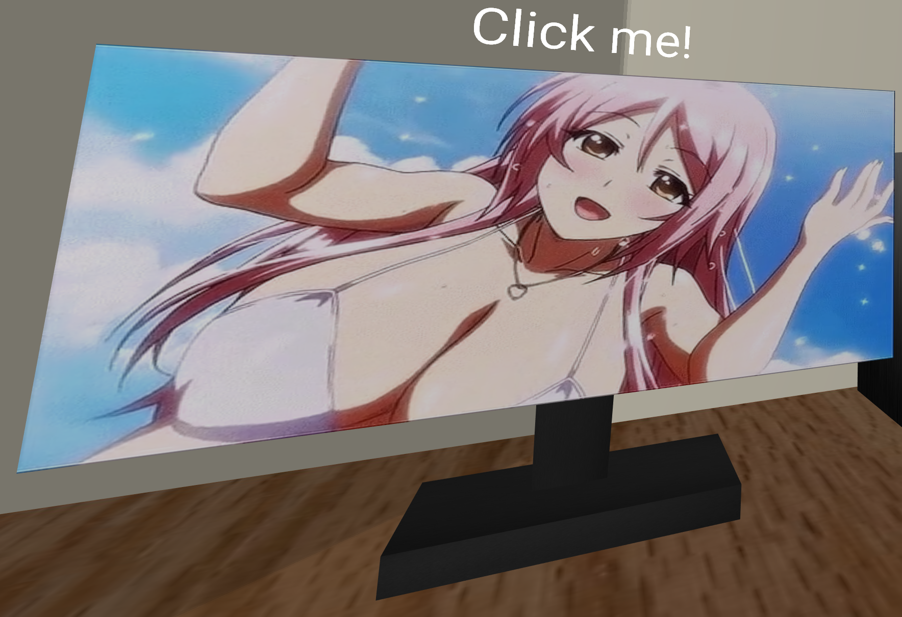
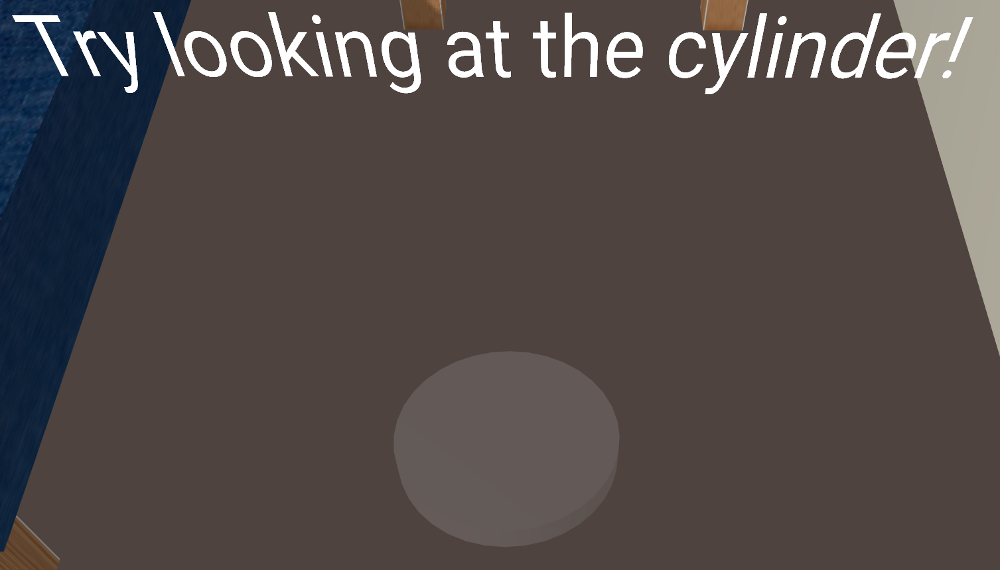
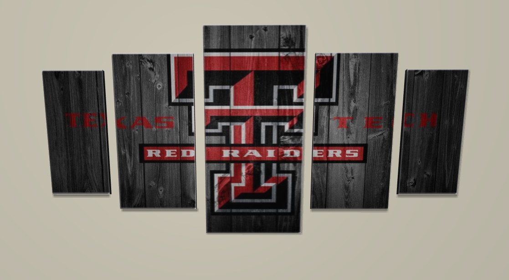

# CS 4331 VR COVID Project

This is my Aframe based VR project for the Texas Tech VR elective class in the CS department. This project was made to introduce many to the VR world and web based VR sites and Google Cardboard projects can be made with [Aframe](https://aframe.io/) and/or [THREE.js](https://threejs.org/). The project instructions were to create our view point and opinion about the COVID pandemic and how it effected us. In my project I chose my apartment room as my location as that's where I spend most of my time, both before and during the COVID pandemic.

You can view my project at this [link](https://sgo-nova.github.io/COVID-Aframe/) or watch my demo at this [link](https://sgo-nova.github.io/COVID-Aframe/Minute.html).

You can also watch my 2 minute presentation at this [link](https://sgo-nova.github.io/COVID-Aframe/Presentation.html).

## About my Project

This project was made with COVID in mind in my room. Things updated were items like my work schedule which was updated to work full time, content on my computer, wall decorations, cleanliness of my room, and additional TV on the wall. Every item in this project, except the TV was modeled by myself either in blender or with a-boxes and other shapes. This project took a lot longer than i expect due to learning a new language almost, and also because of my work schedule. It was a fun time creating a new world and learning at the same time.

#### Bugs

Some bugs are still in this project as there was no way to figure out how to fix them. This includes using cardboard and phones to view this. One day it work and the next it didn't with no code change. I have tried changing camera setting and using default settings, but nothing worked. The .mp4 on the monitor sometimes does not load and makes the user re-enter the site instead of refreshing as it would not fix itself.

## Models

### _Alarm Clock_

### _Bed_

### _Chair_

### _Computer_

### _Desk_

### _Fan & Light_

### _Light Switch_

### _Monitor_

### _Night Stand_

### _Shirt_

### _Teleport Nodes_

### _TV_

### _Wall Art_

### Sources:

Wall Art [link](https://images-na.ssl-images-amazon.com/images/I/61zzaOIDLsL._AC_SX522_.jpg)\
TV model [link](https://free3d.com/3d-model/mi-smart-tv-32-inch-239229.html)\
Shirt Tutorial [link](https://www.youtube.com/watch?v=GcM9nZrG6NY&t)\
Wood picture [link](https://images.assetsdelivery.com/compings_v2/weerapat/weerapat1507/weerapat150700034.jpg)\
Door picture [link](https://secure.img1-fg.wfcdn.com/im/31460569/resize-h800%5Ecompr-r85/3602/36024960/Paneled+Manufactured+Wood+Unfinished+6-Panel+Standard+Door.jpg)\
Pillow picture [link](https://miauss.com/wp-content/uploads/2019/03/PC050007_1.jpg)\
Metal texture [link](https://i.pinimg.com/originals/d4/02/d6/d402d650fd5aa58be87b6de5c87714b8.jpg)\
Dark wood [link](https://1.bp.blogspot.com/-PIdDfu35WX8/WFfXlALv0GI/AAAAAAAARbo/oFlC2XodBOU9eDgROg5lOR2lUpR764XIgCLcB/w1200-h630-p-k-no-nu/seamless_black_fine_wood_texture_texturise.jpg)\
Starry night [link](https://images-na.ssl-images-amazon.com/images/I/91iS91eizUL._AC_SX679_.jpg)\
Plastic picture [link](https://us.123rf.com/450wm/ensup/ensup1205/ensup120500113/13819569-black-plastic-texture.jpg?ver=6)
